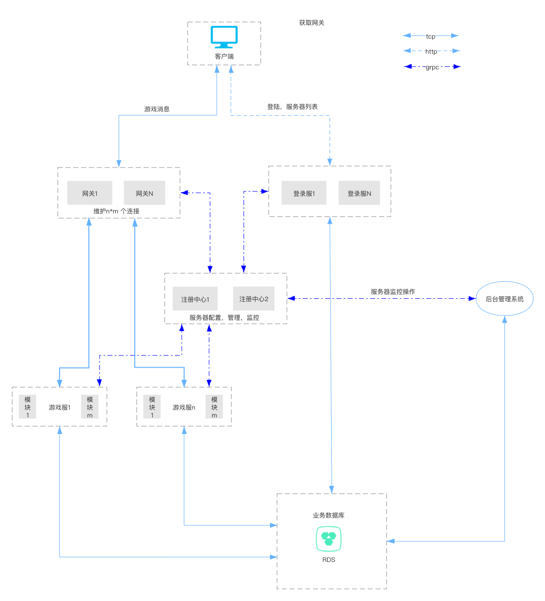

## Intro
&emsp;&emsp;Using Java, netty, zookeeper, spring boot and mongo, redis tools to development of game hot update distributed framework.
Clients to gateways use TCP custom protocols, Intranet message forwarding use GRPC forwarding, 
all stateless services can be horizontally extended, and stateful services can be horizontally extended through partition, state binding and other rules.
The basic architecture of the project is shown below:

 

## Module
1. Logical scripts that end with the project module at the end of `scripts` as the corresponding project can be hot-updated. [docker run](game-res/docker/local/DockerLocalRun.md)  
* [game-common](game-common/README.md) Common logic code  

* [game-message](game-message/README.md) Protobuf message,grpc service  

* [game-gate](game-gate/README.md) Message routing 

* [game-api](game-api/README.md) Login authentication ,charge verify

* [game-hall](game-hall/README.md) Game Demo 

* [game-manage](game-manage/README.md) Web background management, GM, etc

* [game-res](game-res/README.md) Server resource files, Docker scripts, documents, etc
* game-world: World service demo, pause  

## Technology select
1. spring-boot 
2. mongodb 
3. maven 
4. netty 
5. grpc 
6. redis 
7. zookeeper
8. kafka
  
  
  
[中文文档](https://blog.csdn.net/jzhiy/category_10634655.html)  
**QQ Communication group:** 143469012

### TODO
* add microservice
* protobuf sync to GameServer4g
